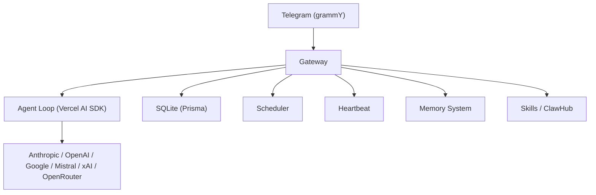

# What is BabyClaw?

BabyClaw is a self-hosted gateway that connects an AI agent to Telegram. You run a single process on your machine (or a server), and it becomes a bridge between your messaging app and an AI model. You message it, it thinks, it can use tools, and it messages you back.

## Why BabyClaw?

[OpenClaw](https://github.com/openclaw/openclaw) is a great project, but it's also a beast -- dozens of channels, companion apps, voice wake, canvas, sandboxing, and a codebase that moves fast. BabyClaw exists because sometimes you just want a personal AI assistant that you can understand end-to-end, hack on, and keep running without chasing upstream changes.

It's not a fork. It's a reimplementation of the parts that matter most for a single-user personal assistant.

Same workspace concept. Same skill ecosystem (ClawHub compatible). Just ~5% of the complexity.

## What's included

- **Agent loop** built on the [Vercel AI SDK](https://sdk.vercel.ai/) -- streaming tool calls, multi-provider support
- **SQLite database** managed with [Prisma](https://www.prisma.io/) -- sessions, messages, schedules, heartbeats, all in one file
- **Telegram channel** via [grammY](https://grammy.dev/) -- text, photos, streaming replies, command approval buttons
- **Scheduler** -- one-off and recurring cron tasks with timezone support and overlap prevention
- **Heartbeat system** -- periodic proactive check-ins with configurable active hours
- **Memory extraction** -- automatic daily memory files
- **Workspace and skills** -- personality files, agent instructions, and the full [ClawHub](https://clawhub.ai) skill ecosystem
- **Shell tool** with allowlist/approval modes
- **Web search** via Brave Search API
- **Browser automation** via MCP (optional)
- **Cross-chat messaging** -- link chats with aliases, send messages between them
- **CLI** with interactive setup wizard, service management, and diagnostics

## Architecture

## BabyClaw vs OpenClaw

| | BabyClaw | OpenClaw |
|---|---|---|
| **Codebase** | ~5% of OpenClaw's size | Large (TypeScript + Swift + Kotlin) |
| **Agent loop** | Vercel AI SDK | Custom Pi agent runtime |
| **Database** | SQLite (Prisma) | In-memory + file-based |
| **Channels** | Telegram (extensible) | 13+ channels |
| **Companion apps** | None | macOS, iOS, Android |
| **Voice** | No | Wake word + Talk Mode |
| **Canvas** | No | A2UI visual workspace |
| **Sandboxing** | No | Docker per-session |
| **Skills** | ClawHub compatible | ClawHub compatible |
| **Workspace** | Same concept | Same concept |

## What you need

- **Node.js 20** or newer
- **pnpm** package manager
- A **Telegram bot token** (free, from [@BotFather](https://t.me/BotFather))
- An **AI provider API key** (Anthropic recommended, but OpenAI, Google, Mistral, xAI, and OpenRouter all work)

Ready to set it up? Head to [Installation](/getting-started/installation).
